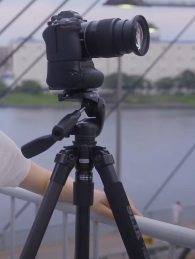
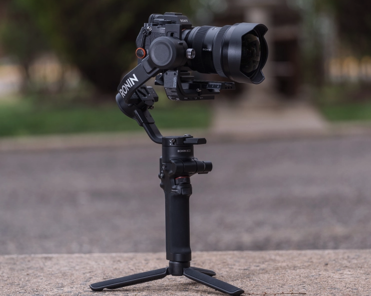

## A Better Camera

Design patterns are used in software design to satisfy a common problem by using a common solution. It’s a method that software developers can use to solve problems that are recurring. These solutions can help the developers fix their code efficiently and prevent future issues by applying the solution to those issues. Some types of design patterns are creational, structural and behavioral. An example of a pattern that I applied to a project is the Model- view-controller pattern. 
First, let me give an analogy of a type of design pattern, structural. For my analogy, I will be using a DSLR camera. A type of structural design pattern that can be used is a decorator design. The pattern allows an object to have additional responsibilities. The developer can add these additional responsibilities to an object to satisfy the requirements. Applying this design to our camera, we first start off with a basic camera. 

Now, I want to capture a photo but when I try to with my basic camera, I am having issues. I’m shaky so I can hold the camera still, there seems to be a glare on the photos and my camera just died so I need to go back to my car to charge the batteries. If I applied a decorator design to my camera, I would need to add some accessories to my camera. These accessories may be a tripod for stillness, a lens hood to avoid glare and a power battery pack so my camera won’t die on me. Now my camera might look something like this: 

Or maybe like this:

Either way, I have resolved my issues by applying this design. In the future, I could add or take off some accessories to satisfy other problems. 
This camera analogy is how software developers can add decorator design patterns to objects while creating and using programs. They can add to the object to satisfy an issue in the program or they can take away accessories if it's not needed and it's wasting time and space. 

## MVC On HMAR

I used the Model-view-controller (MVC) design pattern for my final project. The MVC pattern takes in the user's action to the controller, which then manipulates the model and goes back to the controller as well as the view the user can now see. The final project, me and my team have been working on is an animal response application that allows users to report wild animal sightings. Those reports will then be saved for the animal response team to see and respond to. The MVC pattern applies to when the admin signs in to the application to see the animal reports. The animal reports and locations are not shared with anyone but the organization. So when someone sings in the app it will change to add additional tabs for the animal sightings reports. So breaking down this design to this interaction with the application. The user will sign in to the site, which is the interaction with the controller. The site will then change to show the additional tabs to the user, which is the model responding to the controller. Finally, the user can now see all the reports, which is the view part of the design. The MVC pattern was used to satisfy the requirements of not having general users to the animal reports. 

