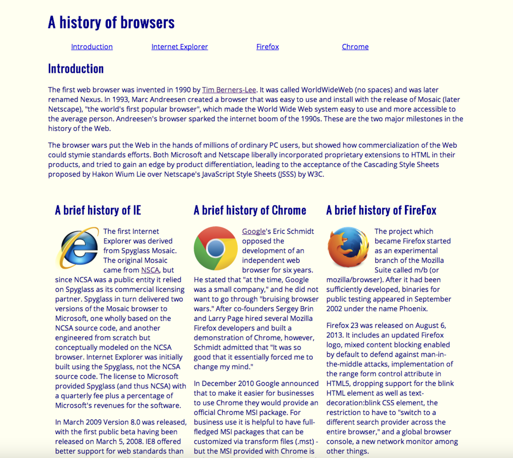

Learning to use user interface frameworks has given me a different perspective of software engineering all together. Being able to use UI frameworks has allowed me to build the front end of programs and be proud of the programs that I create. I never saw myself as someone that would enjoy programming in HTML and CSS because I never was artistically inclined. After learning the basics of user interface and learning the basics of HTML and CSS, my belief of my inability to program something “pretty” was confirmed. However, after learning and exploring different UI frameworks such as Semantic UI, I am able to make a program that I am proud of and actually looks nice. Learning the basics of HTML and CSS is important because applying that knowledge to using other UI frameworks can make you a better software engineer. Using Semantic UI can benefit a software engineer in different ways. First, you are skilled in another part of computer programming. Instead of being skilled in a single area of programming such as Cloud development or backend programming, you can add frontend programming and web development to your skill set. Naturally, this can make you more desirable as a software engineer employee. Secondly, learning to make welcoming and intriguing frontend programs can draw clients and potential investors. A lot of general public people with little to no programming knowledge do not know the difference between the frontend and backend programming. This can be detrimental when trying to “sell yourself” because the programs you show may not have any user experience and can deter clients. Lastly, being able to learn and apply Semantic UI can build your confidence in your programming skills and you can program an application you are proud of. Going through my programming classes, I knew I wanted to gain skills in backend programming and make sure I am as best as I can be in those languages. However, after using Semantic UI and building different web applications, I am now more interested in frontend development and I also have better knowledge in HTML and CSS on top of the UI frameworks.

The difference between programming in raw HTML and CSS and Semantic UI is the visual appeal of the web applications. The top picture is a program made using basic HTML and CSS and the picture to the bottom is a program made using Semantic UI. Using Semantic UI is easier than programming raw because dividing a website is easy and adding the different items and text is also easier. A lot of the time you can guess what needs to be written to get the results you want. Such as when you want a centered image you can just write the word “middle” and if you want a certain icon like a thumbs up icon, you can write “thumbs up icon”. Being able to make a welcoming frontend program can only really benefit aspiring software engineers. As an aspiring software engineer, I would love to learn all the skills to make me a better programmer and be able to grind my way to being the best I can be. And who knows, learning to apply a grid using Semantic UI may be the way to go.  

