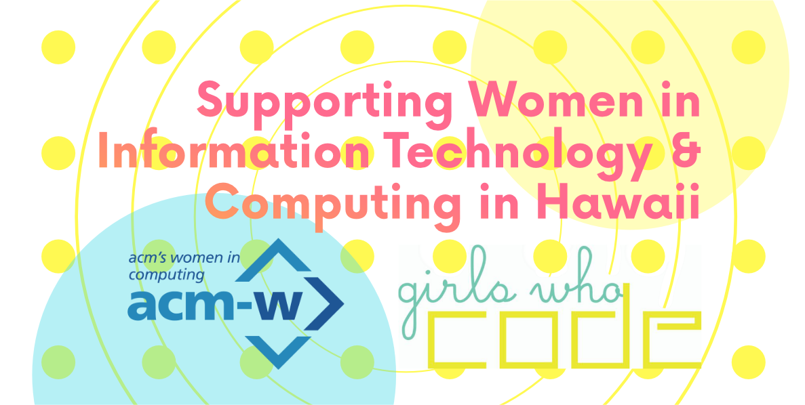

## What I Gained 

After learning and exploring RadGrad, I got a better understanding of what is offered at University of Hawaii at Manoa for students pursuing computer science degrees. Some of the top things I found interesting were the courses and clubs. Knowing what I want to pursue as a career after I graduate, can persuade me to look for classes and courses that support this career. Getting a job as a software engineer for a medical device company is my dream career, however, I have also recently become interested in Augmented and Virtual reality. Going through the RadGrad tutorial provided me with lots of information about what is offered at the school that can help me reach my dream career. I saw that UH at Manoa offers classes such as Lava Lab and ICS 486(VR/AR Programming). Lava Lab is a research lab that offers skills in data visualization and virtual and augmented reality. ICS 486 is a class that teaches programming for AR and VR. I think taking this course and participating in the lab will allow me the chance to gain as much knowledge and experience in AR VR programming, which will be beneficial in the future. Some other courses I found intriguing are ICS 452(Robotic) and 464 (HCI I) because they can provide me with the skills I need for software in robotics and human-computer interaction. These classes will be very helpful because my dream career requires me to program robotics such as surgical robots and to understand human-computer interaction because what I work on will have to be user friendly. A club I will be joining is the SWITCH-UHM club. The club supports women in Information, technology and computing at the university and I never knew it existed before. I think it is important to be surrounded by people that support you and encourage you and I think it even more important to be around people that may be in the same situation such as the same ICS classes. Venting about a program or ICS class to my friend that is a nursing major or to my mom can be helpful but also has its cons. They can support me but they don’t sometimes fully understand why I am frustrated or how to help me. Being around friends that are in the same degree plan and/or took the same classes can be helpful because they can give their perspective and it will be related to the issue. I look forward to joining this club and to meeting and making friends that are also fellow computer science chicas. 

RadGrad definitely is helpful for a better degree experience and an overall experience at UH at Manoa. I did not know half of the clubs and opportunities that the school offered until I saw them on RadGrad. I also got a better understanding of the courses I want to take in the upcoming because I was able to learn about them and what they teach. This helped me determine what classes I should take to better prepare me for my future career. Going through the RadGrad tutorial had helped me and I would recommend this experience to other students. 
