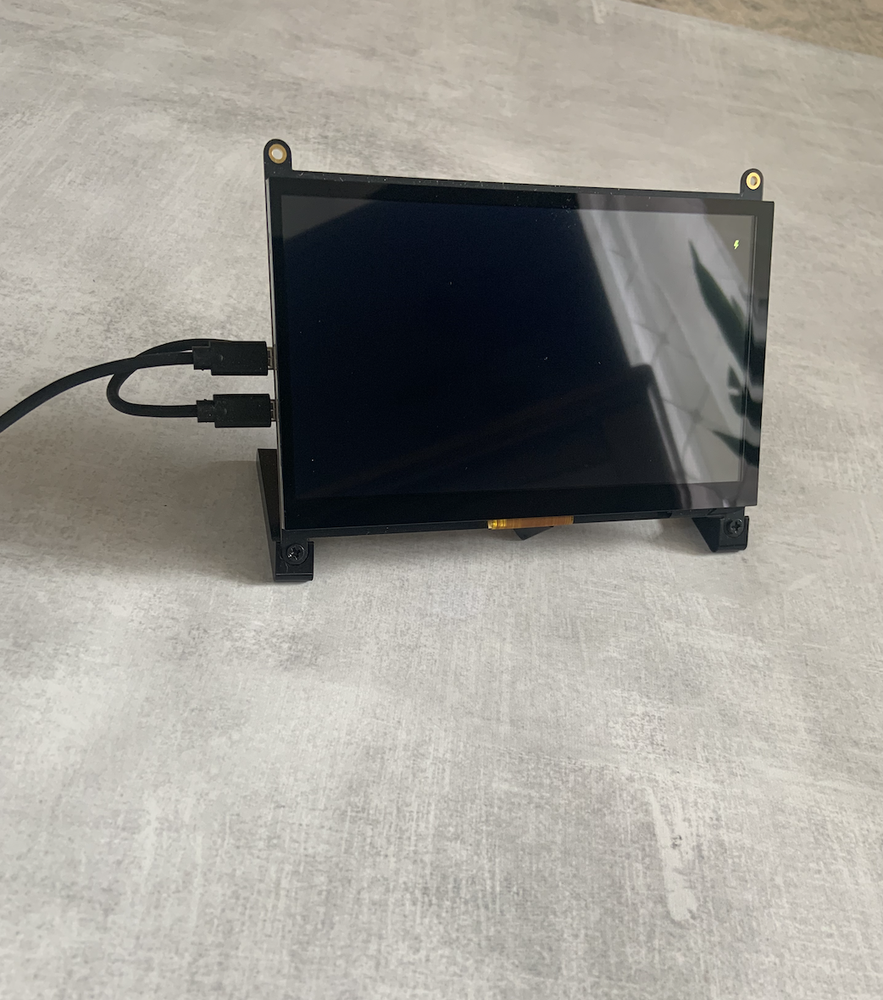

During COVID-19, contact tracing became very important especially on campus where students walk in and out of the STEM Center daily. An easy and efficient way to keep track of students that come in and out of STEM center was to create a tracking application. This applciation would be a better way to track occupancy. The system would ask the students for their name and student email and store it on a server in case contact tracing needs to be done. 

The Kapi’olani Community College Login and Logout system was created for the Science, Technology, Engineering and Mathematics (STEM) Center. It is Raspberry PI based, stand alone, and  operated by a simple touchscreen interface. HTML and CSS was using to make the front end of the application. The backend of the system was programmed with CGI Peral.

The application was completed and connected to the server at the STEM Center. Further research that can be added to this application would be a notification system for students or facutly. If a student was using another student's email, that student can be notified and aware that someone else is using their email. Faculty or staff can also be notified if a student has been tested positive and continues to go on campus. This notification system can help better protect the school and students. 
  
 
You can learn more on my project poster [See project](https://docs.google.com/presentation/d/1c_8Bgc6QUX5HdzP2qM_L8PxCXgPHCjg2/edit#slide=id.p1).
