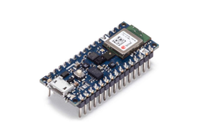
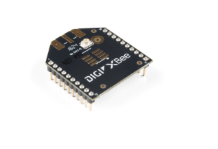
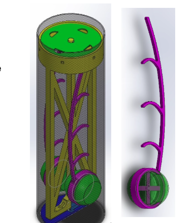
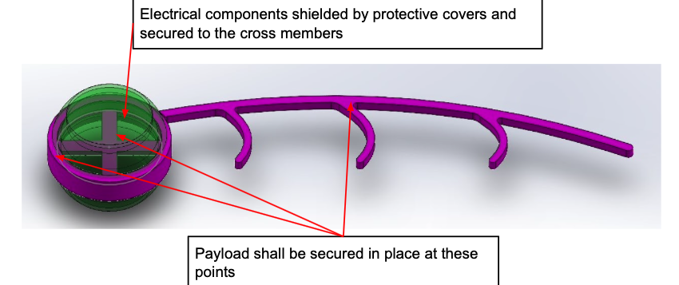

  
  
  
  

Worked as a member of the electrical team to compete in the international CanSat 2021 competition. CanSat is an annual student design-build-launch competition for space-related topics. Teams from all over the world are involved with the end-to-end life cycle of a complex engineering project, from conceptual design, through integration and test, actual operation of the system and concluding with a post-mission summary and debrief. This international competition is acknowledged and sponsored by a number of reputable companies such as: NASA, US Naval Research Laboratory, Lockheed Martin, NRV Rocketry and Siemens among others.

