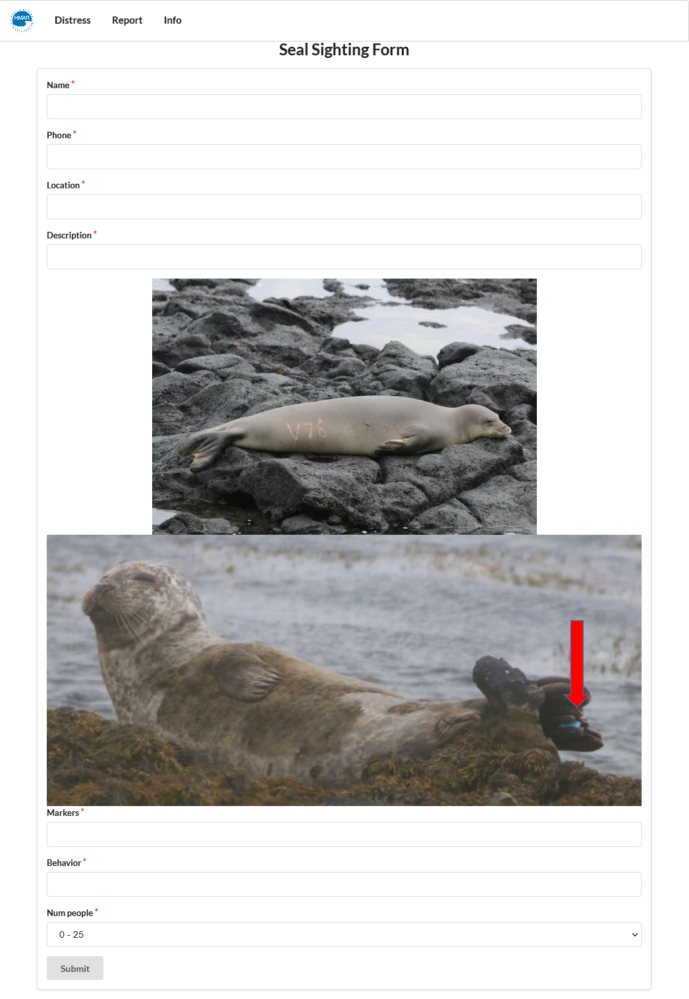

---
layout: project
type: project
image: images/bloombugslogo.png
title: Hawai'i Annual Coding Challenge 2021
permalink: projects/HACC
# All dates must be YYYY-MM-DD format!
date: 2021-05-18
labels:
  - Meteor
  - MongoDB
  - React
  - JavaScript 
  - HTML/CSS
summary: Awarded 2nd place at the Hawaii Annual Code Challenge out of 44 teams.
--- 

  
  

Created a web application for Hawaii Annual Code Challange 2021's Hawai'i Marine Animal Response (HMAR), NIC Hawaii. This sighting and reporting app is to help streamline the process for the public to report monk seals, turtles, and seabirds, to be on a 24/7 web app instead of by call logs. The app helps HMAR resspond the animal sightings and animal's in distress. 

The web application was created using: Meteor, MongoDB, Digital Ocean, HTML/CSS, Javascript and more. We created seperate forms to take in the animal's information. The 3 animals may have different markings and behaviors so it was important to have individual forms for each animal. If an animal is in distress, the user can call HMAR directly or fill out a simplified form in case the user is unable to make a call. The application also included other features such as an interactive map for users to easily pick the location, references for other organizations is also included because HMAR only responds to monk seals, turtles and birds. HMAR can also log in as an admin to see the animal's form submissions. This application will help HMAR respond to animal sightings and help user's reports animal's sightings and animal's in distress. 

Features that can be added to this web application could be a notification system and improving the user interface experience. A notification system would notify HMAR everytime an animal is being reports. Twilio can also be added so if an animal is in distress, HMAR can get an urgent text message. Text messages can also be sent to the HMAR voluteers to describe the animals information for when they go to the sighting location. Improving the interface experience would allow users to easily navigate the app and can provide a more welcoming form page. 
